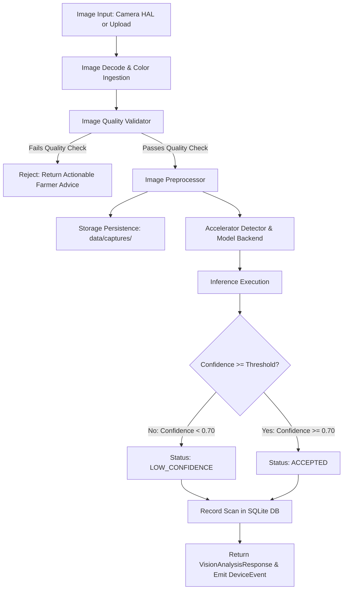

# KrishiDrishti Edge — Offline Edge AI Vision Pipeline

> **Architecture & Lifecycle Documentation**

---

## 1. End-to-End Vision Pipeline Workflow

---

## 2. Pipeline Stages

### Stage 1: Ingestion & Device Capture
- **Camera HAL**: Direct frame grab from `/dev/video0` or libcamera via OpenCV/V4L2.
- **Multipart Upload**: `POST /api/vision/analyze` accepting standard JPEG/PNG bytes.

### Stage 2: Pre-Inference Image Quality Validation (`ai/preprocessing/quality.py`)
Rejects uninformative images before executing expensive neural network inference:
- **Resolution**: Rejects images smaller than $120 \times 120$.
- **Sharpness / Blur (Laplacian Variance)**:
  $$\text{Var} = \operatorname{Var}\left(\nabla^2 I_{\text{gray}}\right) < 18.0 \implies \text{IMAGE\_TOO\_BLURRY}$$
- **Exposure / Luminance**:
  $$\text{Mean}(I_{\text{gray}}) < 20 \implies \text{IMAGE\_TOO\_DARK}$$
  $$\text{Mean}(I_{\text{gray}}) > 240 \implies \text{IMAGE\_TOO\_BRIGHT}$$
- **Farmer Feedback**: Directly returns advice such as *"Image is blurry. Hold the camera steady and focus on the leaf."* without crashing or calling AI.

### Stage 3: Tensor Preprocessing (`ai/preprocessing/preprocessor.py`)
- Color space conversion (BGR $\to$ RGB).
- Dynamic dimension resolution matching target model graph requirements (default: $224 \times 224$).
- Normalization to range $[0.0, 1.0]$ and ImageNet standardization.
- Batch channel expansion to NCHW format: `(1, 3, H, W)`.

### Stage 4: Execution & Acceleration Abstraction (`ai/inference/manager.py`)
- Dynamic auto-detection of Hailo-8 PCIe driver or fallback to CPU.
- Model Registry verification: SHA-256 hash checking and status tracking.
- Monotonic latency profiling with `time.perf_counter()` across decode, preprocess, inference, and postprocess.
- Real hardware mode guarantees zero hallucination: if ONNX weights are not installed, returns `ai_unavailable`.

### Stage 5: Multi-Tier Confidence Protocol
- High Confidence $(\ge 0.85)$: Confirmed condition identification.
- Medium Confidence $(\ge 0.70)$: Moderate condition identification with field inspection prompt.
- Low Confidence $(< 0.70)$: Gated to `"Unknown / Low Confidence"` to prevent risky agronomic advice.

### Stage 6: Offline SQLite Storage & Timeline Integration
- Scans are persisted to the local `scans` table with image storage path, quality metric, confidence score, and model metadata.
- Scans appear immediately in the Field History timeline.
