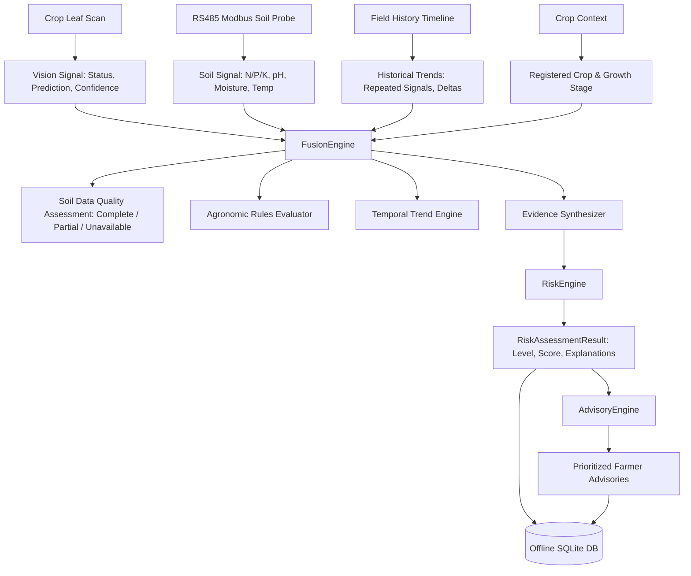

# KrishiDrishti Edge — Crop + Soil Intelligence Fusion Engine

> **Multi-Modal Edge Intelligence Architecture**  
> **Tagline**: *"See. Sense. Predict. Act."*

---

## 1. Overview

The **Intelligence Fusion Engine** (`backend/app/services/fusion/`) is the central cognitive layer of KrishiDrishti Edge. It synthesizes disparate offline field signals:
1. **Crop AI Vision Detections**: Leaf pathology observations with confidence gating and image quality metrics.
2. **6-Parameter RS485 Soil Telemetry**: Nitrogen ($N$), Phosphorus ($P$), Potassium ($K$), $\text{pH}$, Soil Moisture, and Soil Temperature.
3. **Historical Field Timeline**: Chronological observation history, repeated diagnoses, and temporal deltas.
4. **Crop Context**: Registered crop name, variety, growth stage, and sowing date.
5. **Configurable Agronomic Rules**: Transparent reference ranges with zero unverified threshold claims.

---

## 2. Multi-Modal Pipeline Flow

---

## 3. Input Modality Handling & Truthful Fallbacks

| Modality | When Data is Present | When Data is Missing (Real Mode) | When Running in Demo Mode |
|:---------|:---------------------|:---------------------------------|:--------------------------|
| **Vision** | Ingests pathology, applies confidence gating ($P \ge 0.70$). | Returns `status: "unavailable"` / `prediction: "None"`. | Returns simulated demo diagnosis marked `is_demo: true`. |
| **Soil Telemetry** | Populates available parameters ($N, P, K, \text{pH}, \text{moisture}, \text{temp}$). | Strict Nullability: parameters remain `null`, marked `availability: "UNAVAILABLE"`. | Populates simulated 6-in-1 readings with `is_mock: true`. |
| **Field History** | Computes numeric deltas and persistent pathology flags. | Returns `has_sufficient_history: false` and `INSUFFICIENT_HISTORY` note. | Computes deltas if 2+ records exist. |

---

## 4. Safety & Zero Hallucination Invariants

1. **No Silent Zero Coercion**: Missing soil parameters are NEVER replaced with $0.0$ or fake defaults.
2. **Confidence Gating**: Sub-threshold vision inferences ($P < 0.70$) are clamped to `"Unknown / Low Confidence"` to prevent risky agronomic decisions.
3. **UNKNOWN Risk State**: When data completeness is below minimum diagnostic threshold, risk level evaluates directly to `UNKNOWN`.
4. **100% Offline Edge Execution**: All fusion logic executes locally on Raspberry Pi 5 / edge hardware without internet or cloud APIs.
