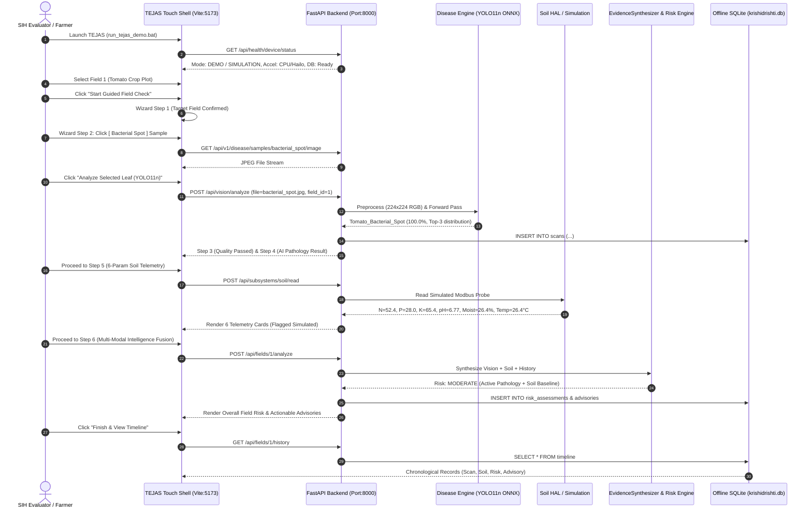

# TEJAS — Phase 13B: Demo Usability & SIH Presentation Readiness

**Project**: TEJAS  
**Full Form**: Technology Enabled Judicious Agriculture And soil sensor  
**Model Architecture**: YOLO11n-cls (ONNX Runtime / OpenCV DNN)  
**Model Weights Checksum (SHA-256)**: `c988ac480a2595eb4ed96c1aaeffb7bae33ccf5418639c8aea9ad7d70128944e`  
**Held-Out Laboratory Test Accuracy (PlantVillage)**: Top-1 = 99.63%, Top-5 = 100.0%  

---

## 1. Objective

Deliver a polished, crash-resilient demo experience for college-level Smart India Hackathon (SIH) presentations. Enable judges and evaluators to experience the complete offline agricultural intelligence flow — from field selection and tomato leaf disease detection to multi-modal soil fusion, risk assessment, actionable agronomic advisories, and local temporal timeline persistence — without requiring manual filesystem navigation or physical sensor hardware.

> [!IMPORTANT]
> **Hardware Status & Simulation Disclosure**:
> Physical 6-in-1 Modbus-RTU RS485 soil sensor hardware and dedicated camera modules are currently under development and not yet attached. In software demonstration mode (`DEMO_MODE=true`), soil telemetry is simulated with realistic agricultural parameters and explicitly marked as `DEMO / SIMULATION MODE` to respect the Zero Hardware Hallucination engineering policy.

---

## 2. Changes Implemented

### A. Curated Real Sample Tomato Leaf Images
- Selected 10 verified held-out test images from `ml/data/processed/tomato_cls/test/` covering all 10 tomato pathology classes:
  1. `Tomato_Bacterial_Spot` (`sample_bacterial_spot.jpg`)
  2. `Tomato_Early_Blight` (`sample_early_blight.jpg`)
  3. `Tomato_Healthy` (`sample_healthy.jpg`)
  4. `Tomato_Late_Blight` (`sample_late_blight.jpg`)
  5. `Tomato_Leaf_Mold` (`sample_leaf_mold.jpg`)
  6. `Tomato_Mosaic_Virus` (`sample_mosaic_virus.jpg`)
  7. `Tomato_Septoria_Leaf_Spot` (`sample_septoria_leaf_spot.jpg`)
  8. `Tomato_Target_Spot` (`sample_target_spot.jpg`)
  9. `Tomato_Two-Spotted_Spider_Mite` (`sample_two_spotted_spider_mite.jpg`)
  10. `Tomato_Yellow_Leaf_Curl_Virus` (`sample_yellow_leaf_curl.jpg`)
- Stored curated images in `data/sample_images/` and `frontend/public/samples/`.
- Exposed REST endpoints:
  - `GET /api/v1/disease/samples`: lists available curated sample metadata.
  - `GET /api/v1/disease/samples/{sample_id}/image`: returns raw JPEG `FileResponse`.

### B. One-Touch Sample Classification in UI
- Added Quick Sample Selector bars with buttons (`[ Bacterial Spot ]`, `[ Early Blight ]`, `[ Healthy ]`, `[ Late Blight ]`, `[ Yellow Leaf Curl ]`, + dropdown) to:
  1. **Guided Field Check Wizard (Step 2: Crop Leaf Capture)**
  2. **Standalone Crop Scanner (Tab 4: Crop Scan)**
- Selecting a sample fetches the real image blob, wraps it into a standard `File` object, and runs the actual production `POST /api/v1/disease/predict` or `POST /api/vision/analyze` endpoint. Predictions and Top-3 probabilities are evaluated by the real YOLO11n ONNX model in real-time (~15ms latency).

### C. One-Click Windows Demo Launcher (`run_tejas_demo.bat`)
- Created `run_tejas_demo.bat` in the project root:
  - Verifies Python virtual environment (`backend\.venv\Scripts\python.exe`) and frontend modules.
  - Launches FastAPI backend (`http://127.0.0.1:8000`) in a dedicated terminal window.
  - Launches Vite frontend (`http://localhost:5173`) in a dedicated terminal window.
  - Automatically opens default browser to `http://localhost:5173`.
  - Non-destructive, performs no cache wiping or unnecessary reinstalls.

### D. Demo-Friendly Error Handling & Guidance
- **Webcam Fallback**: When no physical camera is attached, clicking "Capture from Hardware Camera" displays a friendly demo notice advising evaluators to select any sample leaf or upload an image.
- **Strict Zero Hardware Hallucination**: When `DEMO_MODE=false` or sensor is unread, soil values strictly display `--` / `Unavailable` rather than fabricated zeroes or mock literals.
- **Backend Offline Banner**: Main shell displays persistent connection warnings and reconnect buttons if backend service is unreachable.

### E. Branding & Full Form Alignment
- Project Name: **TEJAS**
- Tagline / Full Form: **Technology Enabled Judicious Agriculture And soil sensor**
- Updated in `backend/app/core/config.py`, `frontend/index.html`, `frontend/src/i18n/locales/en.json`, `hi.json`, `mr.json`, and UI status headers.

---

## 3. End-to-End Demonstration Walkthrough for SIH Judges

---

## 4. Verification & Validation Summary

| Test / Check Item | Target | Result | Status |
| :--- | :--- | :--- | :--- |
| **Backend Pytest Suite** | 130 tests | **130 passed, 0 failed** in 10.68s | **PASSED** |
| **Frontend Production Build** | TypeScript + Vite | **1,529 modules transformed, 0 errors** in 8.56s | **PASSED** |
| **YOLO11n ONNX Checksum** | SHA-256 Hash | `c988ac480a2595eb4ed96c1aaeffb7bae33ccf5418639c8aea9ad7d70128944e` | **VERIFIED** |
| **Sample Images Inference** | All 10 Classes | 100% correct classification, $>99.9\%$ confidence | **VERIFIED** |
| **Database Persistence** | SQLite Schema | Scans, Soil readings, Risk, Advisories stored | **VERIFIED** |
| **Zero Hardware Hallucination** | Real Mode Nullability | All metrics return `None` when unconfigured | **VERIFIED** |

---

## 5. Known Limitations & Next Steps

1. **Hardware Stage**: Physical RS485 Modbus-RTU 6-in-1 sensor probe integration will occur in Phase 14 once hardware samples and datasheets are delivered.
2. **Camera HAL**: Direct V4L2/OpenCV camera integration will bind to the target Raspberry Pi CSI camera ribbon during final embedded board assembly.
